<div align="center">


<table border="0" cellspacing="0" cellpadding="10">
<tr>
<td valign="top"></td>
<td valign="top"></td>
</tr>
</table>

[](https://www.linkedin.com/in/komal-env/)
[](mailto:komalraj2318@gmail.com)
[](https://github.com/komal-env)

<br/>

[](#)
[](#)
[](#)

<br/>


</div>

---

## 🧠 About Me

```yaml
name:       "Komal Priya"
role:       "Aspiring AI Engineer"
education:  "B.Tech CSE @ C.V. Raman Global University, Bhubaneswar"
standing:   "Graduation: 2029 | CGPA: 8.97"
focus:
  - "Core programming — Python, Java, C"
  - "Data Structures & Algorithms"
  - "Machine Learning & Data Science fundamentals"
  - "Generative AI & LLM-powered systems"
open_to:
  - "AI / Machine Learning internships"
  - "Data Science internships"
  - "Open-source & learning-focused collaborations"
```

---

## 🛠️ Tech Stack

**Languages**

  

**Databases & Tools**

    

**AI / ML / Data Science**

[](#)
[](#)
[](#)
[](#)
[](#)

**Generative AI**

[](#)
[](#)
[](#)
[](#)

---

## 🤖 AI / Data Science Focus

| Domain | Proficiency | Details |
|---|---|---|
| Machine Learning Fundamentals | Learning | Building foundations in supervised learning, model evaluation, and data preprocessing |
| Data Science | Learning | Working with structured data using Python (NumPy, Pandas, Matplotlib, Scikit-Learn) |
| Deep Learning | Learning | Exploring neural network fundamentals and core architectures |
| Generative AI | Exploring | Studying prompt engineering, LLM fundamentals, LangChain, RAG and applied GenAI use cases |

---

## 🚀 Featured Projects

<details>
<summary><strong>ATM Simulator</strong></summary>
<br/>

A menu-driven ATM simulation designed to strengthen core Python programming concepts and problem-solving skills.

| Aspect | Detail |
|---|---|
| Stack | Python |
| Core Concepts | Functions, Loops, Conditional Statements, Variables |
| Functionality | PIN authentication, balance check, deposit, withdrawal, exit menu |
| Repository | [github.com/komal-env](https://github.com/komal-env) |

</details>

<details>
<summary><strong>Smart Grocery Bill Generator</strong></summary>
<br/>

A Python application that generates grocery bills based on user input and performs automatic price calculations.

| Aspect | Detail |
|---|---|
| Stack | Python |
| Core Concepts | Variables, Input/Output, Arithmetic Operators, Formatting |
| Functionality | Quantity input, automatic billing, formatted receipt generation |
| Repository | [github.com/komal-env](https://github.com/komal-env) |

</details>

---

## 🏆 Achievements

<div align="center">

| Recognition | Details |
|---|---|
| Academic Standing | CGPA 8.97 · B.Tech CSE, C.V. Raman Global University |
| Applied Project Portfolio | Python projects covering core programming & problem-solving concepts |
| Consistent Growth | Actively developing skills toward AI Engineering & Data Science |

</div>

---

## 💻 Coding Profiles

<div align="center">

[](https://github.com/komal-env)
[](https://www.linkedin.com/in/komal-env/)

</div>

---

## 📊 GitHub Analytics

<div align="center">


</div>

---

## 🏅 GitHub Trophies

<div align="center">


</div>

---

## 📈 Contribution Activity

<div align="center">


</div>

---

## 🐍 Contribution Snake

<div align="center">


</div>

---

## 🎯 Current Focus

```yaml
learning:
  - "Data Structures & Algorithms"
  - "Machine Learning & Data Science fundamentals"
  - "Generative AI & LLM-powered systems"

building:
  - "Applied Python projects with real-world logic"
  - "A stronger, project-driven AI/Data Science portfolio"

open_to:
  - "AI / Machine Learning internships"
  - "Data Science internships"
```

---

## 📬 Connect

<div align="center">

[](mailto:komalraj2318@gmail.com)
[](https://www.linkedin.com/in/komal-env/)
[](https://github.com/komal-env)

</div>

---

<div align="center">

*"Every expert was once a beginner — building intelligent systems, one project at a time."*


</div>
